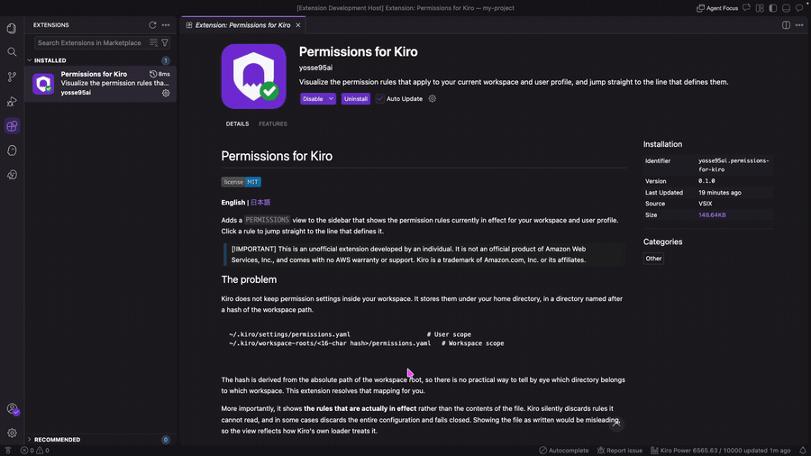

# Permissions for Kiro

[](./LICENSE)

**English** | [日本語](./README.ja.md)

Adds a `PERMISSIONS` view to the sidebar that shows the permission rules currently in effect for your workspace and user profile. Click a rule to jump straight to the line that defines it.



> [!IMPORTANT]
> **Unofficial extension.** This is developed by an individual and is not an official product of Amazon Web Services, Inc. It comes with no AWS warranty or support.
> Kiro is a trademark of Amazon.com, Inc. or its affiliates.

## The problem

Kiro declares permissions per capability, with match patterns and explicit effects. For the model itself, see [Permissions](https://kiro.dev/docs/permissions/) in the Kiro documentation. What this extension addresses is where those rules live, and whether they are actually being applied.

Kiro does not keep permission settings inside your workspace. It stores them under your home directory, in a directory named after a hash of the workspace path.

```
~/.kiro/settings/permissions.yaml                     # User scope
~/.kiro/workspace-roots/<16-char hash>/permissions.yaml   # Workspace scope
```

The hash is derived from the absolute path of the workspace root, so there is no practical way to tell by eye which directory belongs to which workspace. This extension resolves that mapping for you.

More importantly, it shows **the rules that are actually in effect** rather than the contents of the file. Kiro silently discards rules it cannot read, and in some cases discards the entire configuration and fails closed. Showing the file as written would be misleading, so the view reflects how Kiro's own loader treats it.

## Features

- Lists rules for every workspace root plus the user profile
- Three levels: scope, rule (capability and effect), and individual `match` / `exclude` patterns
- Click any leaf row to open the file at the line that defines it
- The pencil icon opens the settings file, creating it if it does not exist yet
- Reloads automatically when a settings file changes, including edits made outside the editor
- **Marks rules that Kiro skips** because of an unknown capability, so you can see why a rule has no effect
- **Warns when the whole configuration fails to load** (`fail closed`), in which case no rule applies at all
- Reports YAML and JSON parse errors with the line that caused them
- Supports `permissions.json` as well as `permissions.yaml`, and multi-root workspaces

## Installation

> [!NOTE]
> **Not published yet.** The extension will be available on Open VSX once the first release is out.

Kiro's extension gallery points at [Open VSX](https://open-vsx.org). Open the Extensions view, search for `Permissions for Kiro`, and install it.

## Usage

Open the Kiro view container in the activity bar. The `PERMISSIONS` view appears below `MCP SERVERS`.

- **Rows with children** expand and collapse. Rows without children jump to their definition.
- **A rule shown as `all`** has no `match` patterns, so it applies to everything the capability covers. Clicking it jumps to the rule itself.
- **`deny` and `ask` are labelled explicitly.** `allow` is left unmarked to keep the list readable.
- **Hover a scope row** to see both the workspace folder and the resolved settings file path.

The view is read only. Add, change, and remove rules by editing the file, which you can open from the pencil icon or by clicking any row. For the rule syntax, see [Permissions](https://kiro.dev/docs/permissions/) in the Kiro documentation.

## Requirements

| Item   | Support                                                                                      |
| ------ | -------------------------------------------------------------------------------------------- |
| Editor | **Kiro only.** The view relies on Kiro's permission model and does not work in plain VS Code |
| Kiro   | Verified on 1.0.288 and later                                                                |
| OS     | macOS and Windows, both verified on real machines                                            |

## How it works

The extension reproduces two things from Kiro itself: the way a workspace path is normalized and hashed to locate the settings directory, and the way rules are validated. That is what lets it show the rules actually in effect instead of the raw file.

Because both behaviours mirror Kiro's internals, a future change in Kiro could make the view diverge from reality. If you notice a mismatch, please [open an issue](https://github.com/yosse95ai/permissions-for-kiro/issues).

## Development

```bash
bun install       # install dependencies
bun run build     # produce dist/extension.js
bun run watch     # rebuild on change
bun run typecheck # type check
bun run lint      # oxlint, type-aware enabled
bun run test      # vitest
bun run package   # build a VSIX
```

Press <kbd>F5</kbd> to launch an extension development host.

## License

[MIT](./LICENSE)

## Trademarks

Kiro and AWS are trademarks of Amazon.com, Inc. or its affiliates. This extension is not affiliated with, nor endorsed by, Amazon Web Services, Inc.
