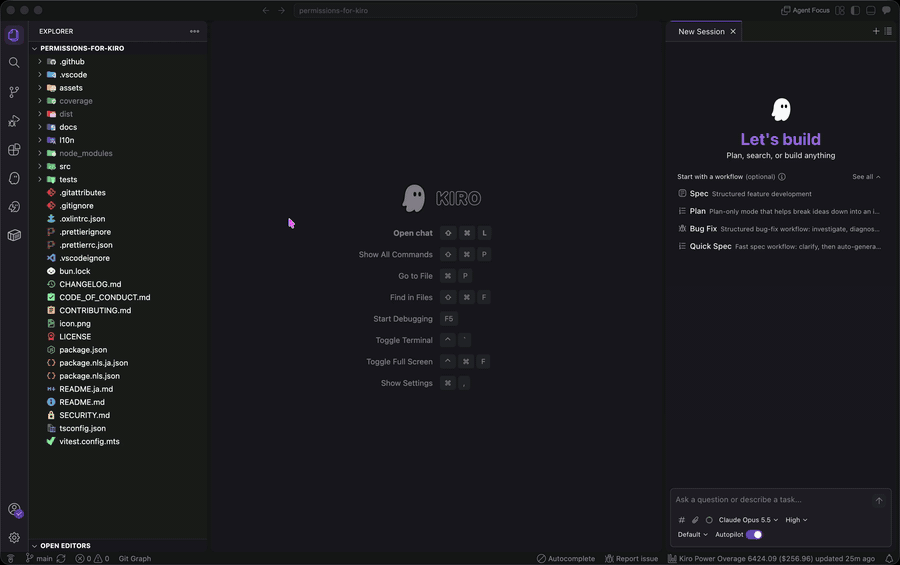

<div align="center">


# Permissions for Kiro

**See the permission rules Kiro actually applies.**<br>Adds a `PERMISSIONS` view to the sidebar so you can see at a glance which permissions are in effect for your workspace and user profile. Click a rule to jump straight to the line that defines it. Completion is available in `permissions.yaml` and `permissions.json` too.

[](https://github.com/yosse95ai/permissions-for-kiro/actions/workflows/ci.yml) [](./LICENSE) [![Built with Kiro][kiro-badge]][kiro] [![Open VSX downloads][downloads-badge]][open-vsx]

**English** | [日本語](./README.ja.md)

</div>


> [!IMPORTANT]
> **Unofficial extension.** This is developed by an individual and is not an official product of Amazon Web Services, Inc. It comes with no AWS warranty or support.
> Kiro is a trademark of Amazon.com, Inc. or its affiliates.

## The problem

Kiro declares permissions per capability, with match patterns and explicit effects. For the model itself, see [Permissions](https://kiro.dev/docs/permissions/) in the Kiro documentation. What this extension addresses is where those rules live, and whether they are actually being applied.

Kiro does not keep permission settings inside your workspace. It stores them under your home directory, in a directory named after a hash of the workspace path.

```
~/.kiro/settings/permissions.yaml                     # User scope
~/.kiro/workspace-roots/<16-char hash>/permissions.yaml   # Workspace scope
```

The hash is derived from the absolute path of the workspace root, so there is no practical way to tell by eye which directory belongs to which workspace. This extension resolves that mapping for you.

More importantly, it shows **the rules that are actually in effect** rather than the contents of the file. Kiro silently discards rules it cannot read, and in some cases discards the entire configuration and fails closed. Showing the file as written would be misleading, so the view reflects how Kiro's own loader treats it.

## Features

- Lists rules for every workspace root plus the user profile
- Three levels: scope, rule (capability and effect), and individual `match` / `exclude` patterns
- Click any leaf row to open the file at the line that defines it
- The pencil icon opens the settings file, creating it if it does not exist yet
- Reloads automatically when a settings file changes, including edits made outside the editor
- **Marks rules that Kiro skips** because of an unknown capability, so you can see why a rule has no effect
- **Warns when the whole configuration fails to load** (`fail closed`), in which case no rule applies at all
- Reports YAML and JSON parse errors with the line that caused them
- Supports `permissions.json` as well as `permissions.yaml`, and multi-root workspaces
- **Completion while editing the file**: rule fields, capability names, and effect values, each with a short description. `match` and `exclude` come with pattern examples for file, shell, and MCP rules
- Hover a rule field, capability, or effect to see the same description

## Installation

Kiro's extension gallery points at [Open VSX](https://open-vsx.org). Open the Extensions view, search for `Permissions for Kiro`, and install it.

The listing is at [yosse95ai.permissions-for-kiro](https://open-vsx.org/extension/yosse95ai/permissions-for-kiro).

## Usage

Open the Kiro view container in the activity bar. The `PERMISSIONS` view appears below `MCP SERVERS`.

- **Rows with children** expand and collapse. Rows without children jump to their definition.
- **A rule shown as `all`** has no `match` patterns, so it applies to everything the capability covers. Clicking it jumps to the rule itself.
- **`deny` and `ask` are labelled explicitly.** `allow` is left unmarked to keep the list readable.
- **Hover a scope row** to see both the workspace folder and the resolved settings file path.

The view is read only. Add, change, and remove rules by editing the file, which you can open from the pencil icon or by clicking any row. For the rule syntax, see [Permissions](https://kiro.dev/docs/permissions/) in the Kiro documentation.



While you edit the file, the editor suggests rule fields, capability names, and effect values. Patterns are not suggested; the description of `match` and `exclude` shows examples for the rule's capability instead. The list also opens after you press Tab or Enter to reach the column where the next field goes. Picking `rules` inserts the first rule up to `- capability: `, and picking `match` or `exclude` inserts the first `- ` on the next line. Hover a field, capability, or effect you have already written to see its description and a link to the Kiro documentation. The extension only suggests. Nothing changes in the file until you accept a suggestion.

Kiro's Autocomplete can show inline suggestions in these files too, and they are not always valid rules. To turn them off, run `Kiro: Toggle Autocomplete Enabled` from the Command Palette. This turns off Autocomplete in every file, not only here.

## Requirements

| Item   | Support                                                                                      |
| ------ | -------------------------------------------------------------------------------------------- |
| Editor | **Kiro only.** The view relies on Kiro's permission model and does not work in plain VS Code |
| Kiro   | Verified on 1.0.288 and later. Completion and hover were verified on 1.1.14                  |
| OS     | macOS and Windows, both verified on real machines                                            |

## How it works

The extension reproduces two things from Kiro itself: the way a workspace path is normalized and hashed to locate the settings directory, and the way rules are validated. That is what lets it show the rules actually in effect instead of the raw file. Completion draws its capability names, rule fields, and effects from the same copy of Kiro's validation rules.

Because both behaviours mirror Kiro's internals, a future change in Kiro could make the view, and the completion suggestions, diverge from reality. If you notice a mismatch, please [open an issue](https://github.com/yosse95ai/permissions-for-kiro/issues).

## Further reading

- [Kiro の Permissions を見える化する拡張機能を作ってみた！ついでに Permissions の仕組みも読み解こう](https://zenn.dev/aws_japan/articles/permissions-for-kiro) (Zenn, in Japanese): why this extension was built, how Kiro's permission model works, and where the settings files live, including how the directory hash is computed

## Development

```bash
bun install       # install dependencies
bun run build     # produce dist/extension.js
bun run watch     # rebuild on change
bun run typecheck # type check
bun run lint      # oxlint, type-aware enabled
bun run test      # vitest
bun run package   # build a VSIX
```

Press <kbd>F5</kbd> to launch an extension development host.

## Contributing

Issues and pull requests are both welcome. [CONTRIBUTING.md](./CONTRIBUTING.md) covers how to get set up and the handful of constraints worth knowing before changing code. Please also read the [Code of Conduct](./CODE_OF_CONDUCT.md).

**Mismatch reports are particularly useful**: if the view says one thing and Kiro does another, that is worth reporting even when nothing looks broken, because the extension mirrors Kiro's internals and Kiro moves on its own.

For anything security related, use [private reporting](./SECURITY.md) instead of a public issue.

## License

[MIT](./LICENSE)

## Trademarks

Kiro and AWS are trademarks of Amazon.com, Inc. or its affiliates. This extension is not affiliated with, nor endorsed by, Amazon Web Services, Inc.

[kiro]: https://kiro.dev/
[kiro-badge]: https://img.shields.io/badge/Built_with-Kiro-8A3FFC?logo=data:image/svg+xml;base64,PHN2ZyB4bWxucz0iaHR0cDovL3d3dy53My5vcmcvMjAwMC9zdmciIHZpZXdCb3g9IjAgMCAyMCAyNCI+PHBhdGggZD0iTTMuOCAxOC41N0MxLjMyIDI0LjA2IDYuNiAyNS40MyAxMC40OSAyMi4yMkMxMS42MyAyNS44MiAxNS45MyAyMy4xNCAxNy40NyAyMC4zNEMyMC44NiAxNC4xOSAxOS40OSA3LjkxIDE5LjE0IDYuNjJDMTYuNzIgLTIuMjEgNC42NyAtMi4yMiAyLjYgNi42NkMyLjExIDguMjIgMi4xIDkuOTkgMS44MyAxMS44MkMxLjY5IDEyLjc1IDEuNTkgMTMuMzQgMS4yMyAxNC4zMUMxLjAzIDE0Ljg3IDAuNzUgMTUuMzcgMC4zIDE2LjIxQy0wLjM5IDE3LjUxIC0wLjEgMjAuMDIgMy40NiAxOC43MlYxOC43MkwzLjggMTguNTdaIiBmaWxsPSJ3aGl0ZSIvPjxwYXRoIGQ9Ik0xMC45NiAxMC40NEM5Ljk3IDEwLjQ0IDkuODIgOS4yNiA5LjgyIDguNTVDOS44MiA3LjkyIDkuOTQgNy40MSAxMC4xNSA3LjA5QzEwLjM0IDYuODEgMTAuNjIgNi42NyAxMC45NiA2LjY3QzExLjMxIDYuNjcgMTEuNiA2LjgxIDExLjgxIDcuMUMxMi4wNSA3LjQzIDEyLjE4IDcuOTMgMTIuMTggOC41NUMxMi4xOCA5Ljc0IDExLjcyIDEwLjQ0IDEwLjk2IDEwLjQ0SDEwLjk2WiIgZmlsbD0iYmxhY2siLz48cGF0aCBkPSJNMTUuMDMgMTAuNDRDMTQuMDQgMTAuNDQgMTMuODkgOS4yNiAxMy44OSA4LjU1QzEzLjg5IDcuOTIgMTQuMDEgNy40MSAxNC4yMiA3LjA5QzE0LjQxIDYuODEgMTQuNjkgNi42NyAxNS4wMyA2LjY3QzE1LjM4IDYuNjcgMTUuNjcgNi44MSAxNS44OCA3LjFDMTYuMTIgNy40MyAxNi4yNSA3LjkzIDE2LjI1IDguNTVDMTYuMjUgOS43NCAxNS43OSAxMC40NCAxNS4wMyAxMC40NEgxNS4wM1oiIGZpbGw9ImJsYWNrIi8+PC9zdmc+Cg==
[open-vsx]: https://open-vsx.org/extension/yosse95ai/permissions-for-kiro
[downloads-badge]: https://img.shields.io/open-vsx/dt/yosse95ai/permissions-for-kiro?label=Open%20VSX%20downloads
